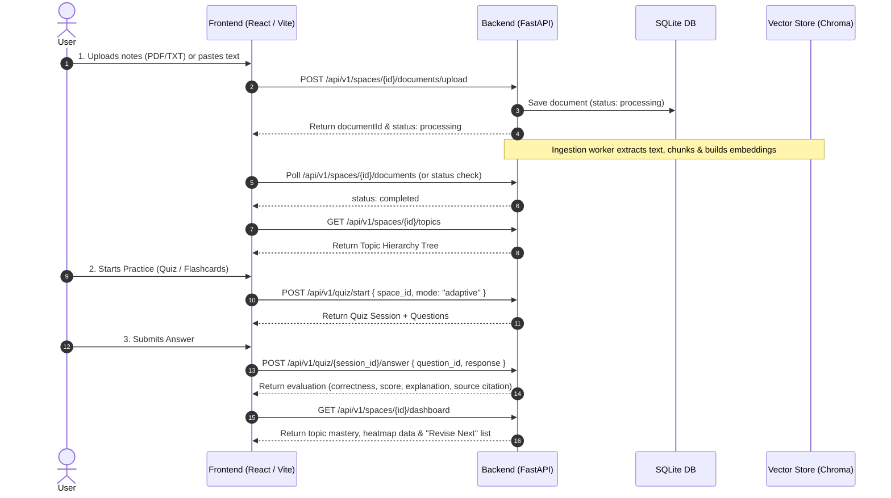

# Architecture & Local Development Workflow

This document defines how **NoteRecall** runs locally and how the Backend and Frontend communicate seamlessly without merge conflicts during parallel vibe coding.

---

## 1. Local Network & Port Conventions

| Service | Technology | Local URL | Port |
|---|---|---|---|
| **Frontend** | React + Vite | `http://localhost:5173` | `5173` |
| **Backend** | FastAPI (Uvicorn) | `http://localhost:8000` | `8000` |
| **API Docs** | Swagger / OpenAPI | `http://localhost:8000/docs` | `8000` |
| **Database** | SQLite | `backend/data/noterecall.db` | Local File |

---

## 2. API Communication & Vite Proxy

To avoid CORS issues and hardcoded URLs:
- The Frontend should make all API requests to the relative prefix: `/api/v1/...`
- Vite's dev server automatically proxies any request starting with `/api` to `http://localhost:8000`:
  ```javascript
  // frontend/vite.config.js
  server: {
    port: 5173,
    proxy: {
      '/api': {
        target: 'http://localhost:8000',
        changeOrigin: true,
      },
    },
  }
  ```

---

## 3. High-Level Flow Between Frontend & Backend



---

## 4. Error Handling Standard

All backend endpoints return errors conforming to this standard JSON shape:

```json
{
  "detail": "Descriptive error message here",
  "error_code": "RESOURCE_NOT_FOUND",
  "status_code": 404
}
```

The frontend Axios / fetch client can always safely display `error.response.data.detail`.
